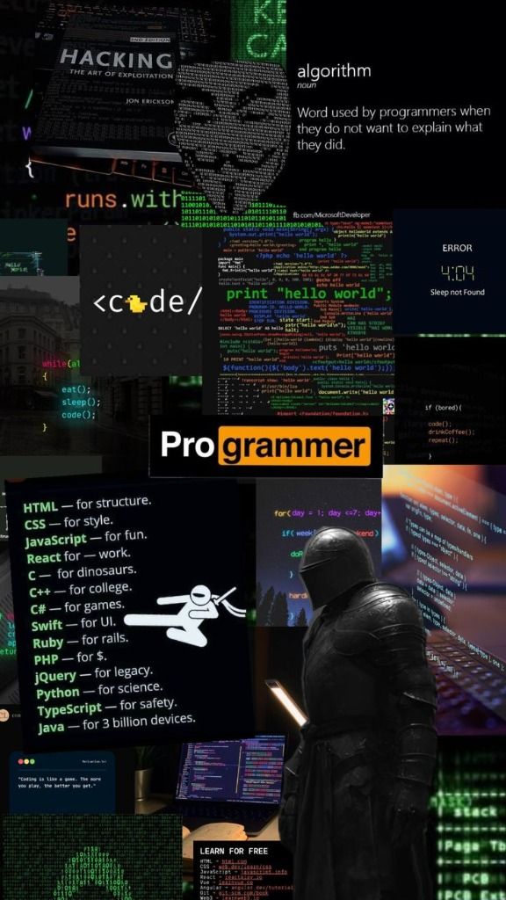

<!-- 
     ╔══════════════════════════════════════════════════════════════╗
     ║   ADITYA SHINDE — GITHUB PROFILE v4.0                      ║
     ║   THEME: ELECTRIC BLUE FUTURISTIC                           ║
     ╚══════════════════════════════════════════════════════════════╝
-->

<div align="center">

<!-- ═══════════ ANIMATED HEADER BANNER ═══════════ -->


<!-- ═══════════ GLITCH TYPING EFFECT ═══════════ -->

<a href="https://git.io/typing-svg"></a>

<br/>

<!-- ═══════════ NEON STATUS BADGES ═══════════ -->


&nbsp;

&nbsp;

&nbsp;


<br/><br/>

<!-- Social Links -->
<a href="https://portfolio-aditya-shinde-40.vercel.app/"></a>
&nbsp;
<a href="https://www.linkedin.com/in/aditya-shinde-307264355/"></a>
&nbsp;
<a href="mailto:educomedyhq23@gmail.com"></a>

</div>

<br/>


<!-- ═══════════════════════════════════════ -->
<!-- ═══════════ ABOUT ME SECTION ═══════════ -->
<!-- ═══════════════════════════════════════ -->

<h2> &nbsp;SYSTEM://about_me</h2>



```ts
interface Developer {
  name: string;
  title: string;
  location: string;
  languages: string[];
  currentMission: string;
}

const aditya: Developer = {
  name: "Aditya Shinde",
  title: "Full-Stack Developer & AI Engineer",
  location: "India 🇮🇳",
  languages: [
    "JavaScript", "TypeScript",
    "Python", "Java"
  ],
  currentMission:
    "Building AI-powered apps that ship & scale"
};
```

<br clear="right"/>

> ```
> ⚡ CORE SYSTEMS ONLINE
> ├── 🔮 Building AI-powered production applications
> ├── 🧠 Integrating Claude AI, Gemini & LLMs into real products
> ├── 🚀 Shipping full-stack apps used by 1000+ users
> ├── 📡 Architecting real-time systems & streaming APIs
> └── ☕ Converting caffeine → production code since 2023
> ```

<br/>


<!-- ═══════════════════════════════════════ -->
<!-- ═══════════ TECH STACK ═══════════════ -->
<!-- ═══════════════════════════════════════ -->

<h2>⚡ SYSTEM://tech_stack</h2>

<div align="center">
<br/>

<!-- Animated Icons Grid -->
<table>
<tr>
<td align="center" width="96">

<br><sub><b>React</b></sub>
</td>
<td align="center" width="96">

<br><sub><b>TypeScript</b></sub>
</td>
<td align="center" width="96">

<br><sub><b>JavaScript</b></sub>
</td>
<td align="center" width="96">

<br><sub><b>Python</b></sub>
</td>
<td align="center" width="96">

<br><sub><b>Java</b></sub>
</td>
<td align="center" width="96">

<br><sub><b>Docker</b></sub>
</td>
<td align="center" width="96">

<br><sub><b>GitHub</b></sub>
</td>
<td align="center" width="96">

<br><sub><b>REST API</b></sub>
</td>
</tr>
</table>

<br/>

<!-- Skill Icons Row -->


<br/><br/>

<!-- AI Specialization Badges -->


</div>

<br/>


<!-- ═══════════════════════════════════════ -->
<!-- ═══════════ PROJECTS ═════════════════ -->
<!-- ═══════════════════════════════════════ -->

<h2>🔮 SYSTEM://deployed_projects</h2>

<div align="center">
<br/>

<!-- Production Apps - Row 1 -->
<a href="https://github.com/adityacs50-lab/Hackmate">

</a>
<a href="https://github.com/adityacs50-lab/Ai-study-assistant-">

</a>

<!-- Production Apps - Row 2 -->
<a href="https://github.com/adityacs50-lab/Levaluplife">

</a>
<a href="https://github.com/adityacs50-lab/Kael-UI">

</a>

<!-- Active Projects - Row 3 -->
<a href="https://github.com/adityacs50-lab/EcoSort-Ai">

</a>
<a href="https://github.com/adityacs50-lab/VibeArch">

</a>

</div>

<br/>

<div align="center">

|  PROJECT | DESCRIPTION | TECH | STATUS |
|:--|:--|:--|:--:|
| **[Hackmate](https://github.com/adityacs50-lab/Hackmate)** | AI team matching · 150+ skills · privacy-first DM chat | `JS` `MongoDB` `Node` `AI` | `▰▰▰▰▰ LIVE` |
| **[AI Study Assistant](https://github.com/adityacs50-lab/Ai-study-assistant-)** | Claude AI tutor · ChatGPT UI · 100MB PDF · streaming | `TS` `React` `Claude` | `▰▰▰▰▰ LIVE` |
| **[Levaluplife](https://github.com/adityacs50-lab/Levaluplife)** | Type-safe full-stack · Supabase · CI/CD pipeline | `TS` `React` `Supabase` | `▰▰▰▰▰ LIVE` |
| **[Kael-UI](https://github.com/adityacs50-lab/Kael-UI)** | JARVIS-style AI interface · voice-activated | `Python` | `▰▰▰▰░ DEV` |
| **[EcoSort AI](https://github.com/adityacs50-lab/EcoSort-Ai)** | Smart waste scanner · eco guidance · AI sorting | `TypeScript` | `▰▰▰▰░ DEV` |
| **[VibeArch](https://github.com/adityacs50-lab/VibeArch)** | Gemini-powered hackathon ideation tool | `TypeScript` | `▰▰▰▰░ DEV` |
| **[Visionai](https://github.com/adityacs50-lab/Visionai)** | Computer vision AI application | `JavaScript` | `▰▰▰▰░ DEV` |

</div>

<br/>


<!-- ═══════════════════════════════════════ -->
<!-- ═══════════ GITHUB STATS ═════════════ -->
<!-- ═══════════════════════════════════════ -->

<h2>📊 SYSTEM://analytics</h2>

<div align="center">
<br/>

<a href="https://github.com/adityacs50-lab">
  
  
</a>

<br/><br/>

<!-- Streak Stats -->
<a href="https://github.com/adityacs50-lab">
  
</a>

<br/><br/>

<!-- Activity Graph -->
<a href="https://github.com/adityacs50-lab">
  
</a>

<br/><br/>

<!-- Trophies -->
<a href="https://github.com/adityacs50-lab">
  
</a>

</div>

<br/>


<!-- ═══════════════════════════════════════ -->
<!-- ═══════════ CAPABILITIES ═════════════ -->
<!-- ═══════════════════════════════════════ -->

<h2>🧬 SYSTEM://capabilities</h2>

<div align="center">

```
                    ┌──────────────────────────────────────────┐
                    │         DEVELOPER SPECIFICATIONS          │
                    └──────────────────────────────────────────┘

    FRONTEND          ████████████████████░░░░  85%   React · TypeScript · Next.js
    BACKEND           ████████████████░░░░░░░░  70%   Node.js · Express · REST APIs
    AI/ML             ████████████████░░░░░░░░  70%   Claude · Gemini · LLMs
    DATABASE          ████████████████████░░░░  80%   MongoDB · PostgreSQL · Supabase
    DEVOPS            ██████████████░░░░░░░░░░  60%   Vercel · Docker · CI/CD
    REAL-TIME         ████████████████░░░░░░░░  70%   WebSockets · Streaming · Sync

    ┌─────────────────────────────────────────────────────────┐
    │  TOTAL POWER OUTPUT:  ██████████████████░░░░ 76%        │
    │  SYSTEM STABILITY:    ████████████████████░░ 90%        │
    │  DEPLOYMENT SPEED:    ████████████████████░░ 88%        │
    └─────────────────────────────────────────────────────────┘
```

</div>

<br/>


<!-- ═══════════════════════════════════════ -->
<!-- ═══════════ CONNECT ══════════════════ -->
<!-- ═══════════════════════════════════════ -->

<h2>📡 SYSTEM://establish_connection</h2>

<div align="center">
<br/>

<a href="https://portfolio-phi-snowy-40.vercel.app/">
  
</a>
&nbsp;
<a href="https://www.linkedin.com/in/aditya-shinde-307264355/">
  
</a>
&nbsp;
<a href="mailto:educomedyhq23@gmail.com">
  
</a>

<br/><br/>

```
 ╔════════════════════════════════════════════════════════════════════╗
 ║                                                                    ║
 ║   📡 TRANSMISSION CHANNELS OPEN                                    ║
 ║                                                                    ║
 ║   ▸ Freelance Projects        ▸ Team Collaborations               ║
 ║   ▸ Open Source Contributions ▸ Hackathon Partnerships            ║
 ║   ▸ AI/ML Integration Work   ▸ Full-Stack Development            ║
 ║                                                                    ║
 ║   > Ready to build the future. Let's connect.                      ║
 ║                                                                    ║
 ╚════════════════════════════════════════════════════════════════════╝
```

<br/>

<!-- Snake -->
<picture>
  <source media="(prefers-color-scheme: dark)" srcset="https://raw.githubusercontent.com/platane/snk/output/github-contribution-grid-snake-dark.svg" />
  <source media="(prefers-color-scheme: light)" srcset="https://raw.githubusercontent.com/platane/snk/output/github-contribution-grid-snake.svg" />
  
</picture>

<br/><br/>


<br/>

</div>

<!-- ═══════════ FOOTER ═══════════ -->

